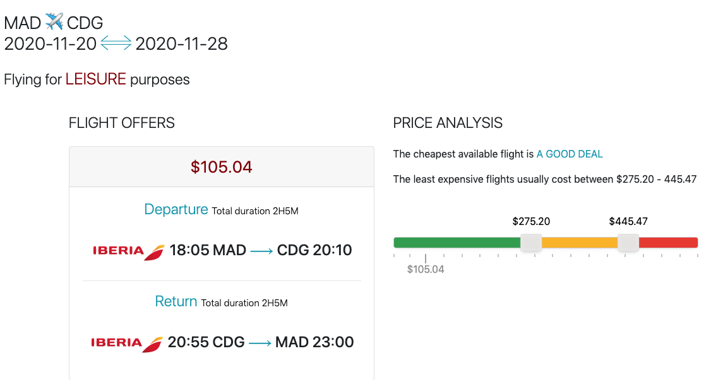

# Flight Search and AI APIs showcase

## What is this?

This prototype retrieves flight offers using the [Flight Offers Search API](https://developers.amadeus.com/self-service/category/air/api-doc/flight-offers-search) for a given itinerary. Then it displays if the cheapest available flight is a good deal based on the [Flight Price Analysis API](https://developers.amadeus.com/self-service/category/air/api-doc/flight-price-analysis). 
We finally predict if the trip is for business or leisure using the [Trip Purpose Prediction API](https://developers.amadeus.com/self-service/category/trip/api-doc/trip-purpose-prediction).

You can also directly view the [demo](https://web-production-53c0.up.railway.app/) of the prototype and refer to the [blog article](https://developers.amadeus.com/blog/flight-price-insights-nouislider-amadeus-apis) as well.



## How to run the project via Docker (recommended)

Build the image from the Dockerfile. The following command will 

```sh
make
```

The container receives your API key/secret from the environment variables.
Before running the container, make sure your have your credentials correctly
set:

```sh
export AMADEUS_CLIENT_ID=YOUR_API_KEY
export AMADEUS_CLIENT_SECRET=YOUR_API_SECRET
export DEBUG_VALUE="True"
```

Finally, start the container from the image:

```
make run
```

At this point you can open a browser and go to `https://0.0.0.0:8000`.

Note that it is also possible to run in detached mode so your terminal is still
usable:

```
make start
```

Stop the container with:

```
make stop
```

## How to run the project locally

Clone the repository.

```sh
git clone https://github.com/amadeus4dev/amadeus-flight-price-analysis-django.git
cd flight-price-analysis
```

Next create a virtual environment and install the dependencies.

```sh
virtualenv venv
source venv/bin/activate
pip install -r requirements.txt
```

For authentication add your API key/secret to your environmental variables.

```sh
export AMADEUS_CLIENT_ID=YOUR_API_KEY
export AMADEUS_CLIENT_SECRET=YOUR_API_SECRET
```

You can easily switch between `test` and `production` environments by setting:

```
export AMADEUS_HOSTNAME="test" # an empty value will also set the environment to test
```

or

```
export AMADEUS_HOSTNAME="production"
```

> Each environment has different API keys. Do not forget to update them!

Finally, run the Django server.

```sh
python pricing/manage.py runserver
```

Finally, open a browser and go to `http://127.0.0.1:8000/`

## License

This library is released under the [MIT License](LICENSE).

## Help

You can find us on [StackOverflow](https://stackoverflow.com/questions/tagged/amadeus) or join our developer community on
[Discord](https://discord.gg/cVrFBqx).

